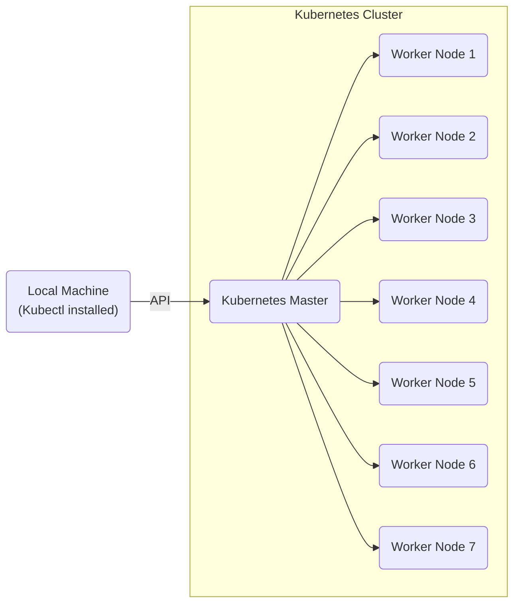

# Installation
> Note: The current scripts are mainly developed to work on Linux and MacOS. 

Here we provided the scripts for installation on both [Google Cloud Platform](#installing-on-google-cloud) or baremetal servers.
In general, all the experiments provided here will be running on a remote Kubernetes cluster while they are executed on a local machine. The high-level presentation for this method is shown below:




## Installing on Google Cloud
1. First of all, you may need to create an account for Google Cloud Platform (GCP), see [here](https://cloud.google.com/free). During this step you may be asked to [create a new project](https://cloud.google.com/resource-manager/docs/creating-managing-projects).
2. The next step is to [select the project or create one](https://console.cloud.google.com/projectselector2/home/dashboard).
3. Now we need to enable the Deployment Manager and Compute Engine APIs, enable them [here](https://console.cloud.google.com/apis/enableflow?apiid=deploymentmanager,compute_component)
4. For this project, we need eight virtual machines with 8 CPU cores in `europe-north-1` region (we tested there). To this end, we need to increase the CPU quotas to 64 (at least), You can select all of the required quotas and increase them to 64 [here](https://console.cloud.google.com/iam-admin/quotas?pageState=(%22allQuotasTable%22:(%22f%22:%22%255B%257B_22k_22_3A_22Service_22_2C_22t_22_3A10_2C_22v_22_3A_22_5C_22Compute%2520Engine%2520API_5C_22_22_2C_22s_22_3Atrue_2C_22i_22_3A_22serviceTitle_22%257D_2C%257B_22k_22_3A_22Dimensions%2520%2528e.g.%2520location%2529_22_2C_22t_22_3A10_2C_22v_22_3A_22_5C_22region_3Aeurope-north1_5C_22_22_2C_22s_22_3Atrue_2C_22i_22_3A_22displayDimensions_22%257D_2C%257B_22k_22_3A_22Quota_22_2C_22t_22_3A10_2C_22v_22_3A_22_5C_22CPUs_5C_22_22_2C_22s_22_3Atrue_2C_22i_22_3A_22displayName_22%257D_2C%257B_22k_22_3A_22_22_2C_22t_22_3A10_2C_22v_22_3A_22_5C_22OR_5C_22_22_2C_22o_22_3Atrue_2C_22s_22_3Atrue%257D_2C%257B_22k_22_3A_22Quota_22_2C_22t_22_3A10_2C_22v_22_3A_22_5C_22E2%2520CPUs_5C_22_22_2C_22s_22_3Atrue_2C_22i_22_3A_22displayName_22%257D_2C%257B_22k_22_3A_22Dimensions%2520%2528e.g.%2520location%2529_22_2C_22t_22_3A10_2C_22v_22_3A_22_5C_22region_3Aeurope-north1_5C_22_22_2C_22s_22_3Atrue_2C_22i_22_3A_22displayDimensions_22%257D_2C%257B_22k_22_3A_22_22_2C_22t_22_3A10_2C_22v_22_3A_22_5C_22OR_5C_22_22_2C_22o_22_3Atrue_2C_22s_22_3Atrue%257D_2C%257B_22k_22_3A_22Quota_22_2C_22t_22_3A10_2C_22v_22_3A_22_5C_22CPUs%2520%2528all%2520regions%2529_5C_22_22_2C_22s_22_3Atrue_2C_22i_22_3A_22displayName_22%257D%255D%22))). 
> Note: Make sure that you are increasing the quota for the right project.

> Note: This may take some time up to 24 hours to be confirmed by Google Cloud Platform support. 
5. To be able to install everthing on Google Cloud Platform, we may need to install to GCP CLI. Follow the [official instructions](https://cloud.google.com/sdk/docs/install) to install it.
6. Then login using the following command. After running this command, a login screen is displayed.
    ```
    $ gcloud auth login


    # The output will be something like this:
    You are now logged in as [example@gmail.com].
    Your current project is [your-recent-project-ID].  You can change this setting by running:
        $ gcloud config set project PROJECT_ID
    ```
7. To be able to manage the installed cluster on your local machine, you may need to install `kubectl` on it. Follow the instructions provided [here](https://kubernetes.io/docs/tasks/tools/#kubectl) for installation of `kubectl`.
8. The actual setup is in this step, but you may need to consider some notes:
> **Important Note**: If you already are using a kubernetes cluster on your local machine, you may need to create a backup for that, as this step will replace `~/.kube/config` file. For creating a backup just run the following:

    $ mv ~/.kube/config ~/.kube/config-bak

If you don't have anything installed on your local machine, you can simply ignore the previous note and run the followings:

    $ cd installation
    $ sh ./gcp-installation.sh

> Note: This procedure will create 8 VM instances on GCP and setup a Kubernetes cluster and Istio. **This may take up to 15 minutes**, take your time and enjoy your coffee!
